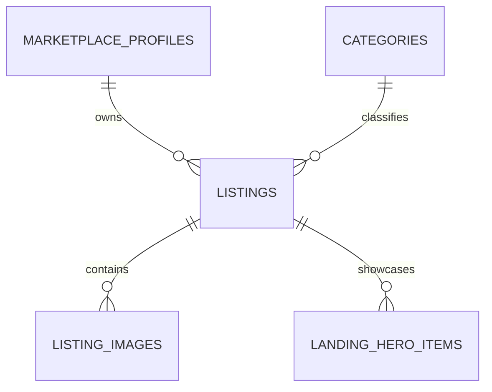

# GearSphere listing schema and database wiring

## 1. Scope and current state

This is an implementation plan, not an applied migration. Only this document was created for this task.

The current application has:

- Next.js 16.3.4 and React 19.
- Demo categories and listings in `src/components/landing/catalog.tsx`.
- `FeatureEquipment` accepting an optional `equipment` prop and defaulting to demo data.
- Image paths assembled as `/images/landing/{image}.jpg` in both equipment cards and the details dialog.
- Static category and hero photos.
- Client-side category filtering and equipment details dialogs.
- A credentials authentication prototype, without persistent database users.
- No database driver or ORM listed in `package.json`.

**Design assumption:** PostgreSQL for listing records and object storage for image files. The project has not yet selected these services. Adapt the SQL to your chosen database if it differs; this document does not require a particular hosting provider or ORM.

## 2. Where listings and images live

**Database:** listing descriptions, ownership, categories, prices, publication state, and image metadata.

**Object storage:** the actual JPEG, PNG, or WebP files. Store stable storage keys in the database, not expiring signed URLs or base64-encoded images.

Example:

```text
Database listing:
  id: <listing UUID>
  title: Cordless Power Drill
  daily_rate_minor: 1500
  currency: USD

Database image record:
  listing_id: <listing UUID>
  storage_key: listings/<listing UUID>/<image UUID>.webp
  alt_text: Cordless power drill on a workshop bench

Object storage:
  listings/<listing UUID>/<image UUID>.webp

Public image URL produced by the server:
  https://<your-image-host>/listings/<listing UUID>/<image UUID>.webp
```

The browser receives public listing data and image URLs. It never receives database credentials or storage administration keys.

## 3. Relationships



A listing belongs to one owner and one category. It can have multiple images. Its first ready image by display order is its cover image.

## 4. Proposed PostgreSQL schema

UUIDs are generated by the server before insertion. This avoids requiring a particular database UUID extension.

### Persistent owner identity

`marketplace_profiles` bridges authenticated users to listings. If the eventual authentication adapter already has a persistent user table, reference that table instead and avoid duplicating it.

```sql
CREATE TABLE marketplace_profiles (
  id UUID PRIMARY KEY,
  auth_subject TEXT NOT NULL UNIQUE,
  display_name TEXT NOT NULL CHECK (length(trim(display_name)) > 0),
  created_at TIMESTAMPTZ NOT NULL DEFAULT now()
);
```

`auth_subject` must be the stable, namespaced identity provided by the server's verified authentication session. Never accept it from a listing form. The current mock session ID is not a production ownership system; wire real persistent authentication before enabling uploads or listing creation.

### Categories

```sql
CREATE TABLE categories (
  id UUID PRIMARY KEY,
  slug TEXT NOT NULL UNIQUE
    CHECK (slug ~ '^[a-z0-9]+(-[a-z0-9]+)*$'),
  name TEXT NOT NULL CHECK (length(trim(name)) BETWEEN 1 AND 80),
  description TEXT NOT NULL DEFAULT '',
  image_storage_key TEXT,
  image_alt TEXT,
  image_width INTEGER CHECK (image_width > 0),
  image_height INTEGER CHECK (image_height > 0),
  sort_order INTEGER NOT NULL DEFAULT 0 CHECK (sort_order >= 0),
  is_active BOOLEAN NOT NULL DEFAULT TRUE,
  created_at TIMESTAMPTZ NOT NULL DEFAULT now(),
  updated_at TIMESTAMPTZ NOT NULL DEFAULT now(),
  CHECK (
    (image_storage_key IS NULL AND image_alt IS NULL
      AND image_width IS NULL AND image_height IS NULL)
    OR
    (image_storage_key IS NOT NULL AND length(trim(image_storage_key)) > 0
      AND image_alt IS NOT NULL AND length(trim(image_alt)) > 0
      AND image_width IS NOT NULL AND image_height IS NOT NULL)
  )
);
```

Initial category slugs:

| Slug | Display name |
| --- | --- |
| construction | Construction |
| photography | Photography |
| events | Events |
| tools | Tools |
| agriculture | Agriculture |
| electronics | Electronics |

Category artwork is editorial content: only administrators should change it. Missing artwork uses an explicit local fallback. Update the key and metadata only after the uploaded file is verified.

### Listings

```sql
CREATE TABLE listings (
  id UUID PRIMARY KEY,
  owner_id UUID NOT NULL REFERENCES marketplace_profiles(id) ON DELETE RESTRICT,
  category_id UUID NOT NULL REFERENCES categories(id) ON DELETE RESTRICT,
  slug TEXT NOT NULL UNIQUE
    CHECK (slug ~ '^[a-z0-9]+(-[a-z0-9]+)*$'),
  title TEXT NOT NULL CHECK (length(trim(title)) BETWEEN 3 AND 120),
  description TEXT NOT NULL CHECK (length(trim(description)) BETWEEN 20 AND 5000),
  daily_rate_minor INTEGER NOT NULL
    CHECK (daily_rate_minor BETWEEN 1 AND 100000000),
  currency VARCHAR(3) NOT NULL CHECK (currency IN ('USD', 'NGN')),
  condition TEXT NOT NULL
    CHECK (condition IN ('new', 'like_new', 'good', 'fair')),
  city TEXT NOT NULL CHECK (length(trim(city)) BETWEEN 1 AND 120),
  country_code VARCHAR(2) NOT NULL CHECK (country_code ~ '^[A-Z]{2}$'),
  included_items TEXT[] NOT NULL DEFAULT '{}',
  status TEXT NOT NULL DEFAULT 'draft'
    CHECK (status IN ('draft', 'published', 'paused', 'archived')),
  is_featured BOOLEAN NOT NULL DEFAULT FALSE,
  featured_order INTEGER NOT NULL DEFAULT 0 CHECK (featured_order >= 0),
  published_at TIMESTAMPTZ,
  created_at TIMESTAMPTZ NOT NULL DEFAULT now(),
  updated_at TIMESTAMPTZ NOT NULL DEFAULT now(),
  CHECK (status <> 'published' OR published_at IS NOT NULL)
);

CREATE INDEX listings_public_category_idx
  ON listings(category_id, published_at DESC, id)
  WHERE status = 'published';

CREATE INDEX listings_featured_idx
  ON listings(featured_order, published_at DESC, id)
  WHERE status = 'published' AND is_featured = TRUE;

CREATE INDEX listings_owner_idx ON listings(owner_id, status);
```

Notes:

- Prices use integer minor units: `1500 USD` means $15.00; `1500 NGN` means ₦15.00. These two proposed currencies both use two decimal places. Extend the supported currency list and conversion rules deliberately if more currencies are introduced.
- Validate real country codes in the service; the SQL check only validates their shape.
- Treat `featured_order` ties deterministically using publication time and ID.
- `included_items` holds short kit contents such as “Battery and charger.” Validate a maximum of 20 entries, each nonblank and at most 120 characters.
- Set `updated_at = now()` on every update; its default alone does not maintain it.
- Publication does not mean the item is available for particular dates. Booking and availability need separate records and checks.
- Archive listings rather than deleting records that may later be referenced by bookings.

### Listing images

```sql
CREATE TABLE listing_images (
  id UUID PRIMARY KEY,
  listing_id UUID NOT NULL REFERENCES listings(id) ON DELETE CASCADE,
  storage_key TEXT NOT NULL UNIQUE CHECK (length(trim(storage_key)) > 0),
  alt_text TEXT NOT NULL CHECK (length(trim(alt_text)) BETWEEN 1 AND 250),
  sort_order INTEGER NOT NULL DEFAULT 0 CHECK (sort_order >= 0),
  status TEXT NOT NULL DEFAULT 'pending'
    CHECK (status IN ('pending', 'ready', 'rejected')),
  mime_type TEXT NOT NULL
    CHECK (mime_type IN ('image/jpeg', 'image/png', 'image/webp')),
  byte_size INTEGER NOT NULL CHECK (byte_size BETWEEN 1 AND 10485760),
  width INTEGER NOT NULL CHECK (width BETWEEN 1 AND 12000),
  height INTEGER NOT NULL CHECK (height BETWEEN 1 AND 12000),
  created_at TIMESTAMPTZ NOT NULL DEFAULT now(),
  UNIQUE (listing_id, sort_order) DEFERRABLE INITIALLY DEFERRED
);

CREATE INDEX listing_images_ready_idx
  ON listing_images(listing_id, sort_order, id)
  WHERE status = 'ready';
```

Image rules:

1. Allow up to eight images per listing, enforced in a transaction that locks the parent listing.
2. The cover is the ready image with the lowest `sort_order`. No competing `is_cover` flags are needed.
3. Reordering occurs in a transaction; the deferred uniqueness constraint allows swapping positions.
4. Only trusted server verification can mark an image `ready`. Client-supplied MIME types, dimensions, and byte counts are not proof of the uploaded file's contents.
5. Publishing requires at least one ready image, an active category, valid listing fields, and an authorized owner. Lock the listing while checking and publishing.
6. Removing the last ready image from a published listing must either be rejected or pause the listing in the same transaction.
7. Deleting an image row does not delete its storage object. Queue storage deletion with retries after the database transaction succeeds.

### Optional: database-controlled hero photos

```sql
CREATE TABLE landing_hero_items (
  slot TEXT PRIMARY KEY CHECK (slot IN ('main', 'top', 'bottom')),
  listing_id UUID NOT NULL REFERENCES listings(id) ON DELETE RESTRICT,
  caption TEXT NOT NULL CHECK (length(trim(caption)) BETWEEN 1 AND 80)
);
```

Administrators select which published listings appear in the three existing hero positions. The public query must still require a published listing, active category, and ready cover image. If a selection is unpublished or missing, use the existing local hero artwork. Keep the existing layout and animation classes.

## 5. Server-to-component data shape

Create shared types in a future `src/types/listing.ts`. These must not live only in `catalog.tsx`, because that module is marked `"use client"`.

```ts
export type ListingImage = {
  id: string;
  url: string;
  alt: string;
  width: number;
  height: number;
};

export type CategorySummary = {
  id: string;
  slug: string;
  name: string;
  description: string;
  image: ListingImage | null;
};

export type ListingSummary = {
  id: string;
  slug: string;
  name: string;
  category: { id: string; slug: string; name: string };
  dailyRateMinor: number;
  currency: "USD" | "NGN";
  description: string;
  includes: string[];
  coverImage: ListingImage;
  images: ListingImage[];
  ratingAverage: number | null;
  reviewCount: number;
};
```

The category image adapter can use the category ID as its image ID; category artwork has no separate image row in this design.

Return plain JSON-compatible values, not ORM instances. Omit owner email, storage credentials, exact pickup addresses, and unpublished media. For this first version return `ratingAverage: null` and `reviewCount: 0`; show “No reviews yet.” Do not carry the sample ratings into live listings.

Real reviews should later reference completed bookings and authenticated reviewers, with one review per eligible booking and ratings constrained to 1–5. Aggregate only public approved reviews.

## 6. Read query and mapping

The landing page initially loads up to four featured listings. Call the section **Featured equipment**, because editorial selection does not establish popularity.

The query below returns one row per listing and its ready image gallery. Parameter `$1` is a server-validated limit, initially `4`; never interpolate request strings into SQL.

```sql
SELECT
  l.id, l.slug, l.title, l.description, l.included_items,
  l.daily_rate_minor, l.currency,
  c.id AS category_id, c.slug AS category_slug, c.name AS category_name,
  gallery.images
FROM listings l
JOIN categories c ON c.id = l.category_id AND c.is_active = TRUE
JOIN LATERAL (
  SELECT jsonb_agg(
    jsonb_build_object(
      'id', i.id,
      'storageKey', i.storage_key,
      'alt', i.alt_text,
      'width', i.width,
      'height', i.height
    ) ORDER BY i.sort_order, i.id
  ) AS images
  FROM listing_images i
  WHERE i.listing_id = l.id AND i.status = 'ready'
) gallery ON gallery.images IS NOT NULL
WHERE l.status = 'published' AND l.is_featured = TRUE
ORDER BY l.featured_order ASC, l.published_at DESC, l.id
LIMIT $1;
```

In the server mapper:

- `title` → `name`.
- Category columns → `category`.
- `included_items` → `includes`.
- Convert image storage keys into URLs using your configured image host.
- Map gallery images to `ListingImage[]`; the first becomes `coverImage`.
- Preserve `daily_rate_minor` as an integer.
- Return `ratingAverage: null`, `reviewCount: 0` until real reviews exist.

Generate storage keys on the server and restrict them to the expected listing prefix. Encode path segments when constructing URLs; do not turn arbitrary submitted URLs into trusted image sources.

Empty query results return `[]`. Database failures should produce a recoverable “Equipment is temporarily unavailable” state, with server-side logging. Do not silently fall back to fake listings.

## 7. Wire the current Next.js page

### Future file responsibilities

| File | Planned responsibility |
| --- | --- |
| `src/lib/db.ts` | Server-only database connection pool using the selected driver |
| `src/lib/storage.ts` | Server-only storage operations and public URL construction |
| `src/lib/listings.ts` | Parameterized reads, public visibility rules, and DTO mapping |
| `src/lib/categories.ts` | Active category reads, sorted by display order |
| `src/types/listing.ts` | Shared serializable types |
| `src/app/page.tsx` | Fetch data on the server and pass props to existing components |
| `src/components/landing/catalog.tsx` | Category-selection context only; remove demo data from production flow |
| `src/components/landing/Categories.tsx` | Render category props from the database |
| `src/components/landing/FeatureEquipment.tsx` | Render listing props and use supplied image URLs |
| `src/components/landing/Hero.tsx` | Optionally render database-selected photos with local fallbacks |
| `next.config.ts` | Allow the actual storage/CDN host for Next Image |

The proposed server modules should import `"server-only"`. Select/install the database driver during implementation. None of these files or dependencies is created by this document.

### Server fetching

Keep `page.tsx` a Server Component. It may be `async` while `LandingMotion`, filters, and dialogs remain Client Components.

The essential integration is:

```tsx
// Illustrative integration: the service functions must first be implemented.
import { connection } from "next/server";
import { getFeaturedListings } from "../lib/listings";
import { getActiveCategories } from "../lib/categories";

export default async function Home() {
  await connection();
  const [equipment, categories] = await Promise.all([
    getFeaturedListings({ limit: 4 }),
    getActiveCategories(),
  ]);

  // Preserve Header, LandingMotion, Hero, ValueProps, HowItWorks,
  // WhyGearSphere, Testimonials, FinalCTA, and Footer in their current order.
  // Inside the existing CatalogProvider:
  // <Categories categories={categories} />
  // <HowItWorks />
  // <FeatureEquipment equipment={equipment} categories={categories} />
}
```

This is an integration sketch, not a complete replacement for the existing page.

The installed Next.js guide documents `connection()` for request-time rendering. Use it initially so changes do not require rebuilding the app. Do not introduce a home-page HTTP call back into your own API just to read the database; call the server service directly.

Later, caching can reduce database work. Define invalidation for listing publication, edits, image replacements, category changes, and archival before adding caching. Refresh an already-open page to see new server data; request-time reads alone are not a real-time subscription.

### Change the equipment component

1. Require `equipment: ListingSummary[]`; remove the implicit demo default.
2. Accept `categories: CategorySummary[]`.
3. Replace both hard-coded image paths: the card uses `item.coverImage.url`; the dialog uses `selected.coverImage.url`.
4. Use the image's supplied alt text. Keep the existing responsive `fill` and `sizes` behavior.
5. Optionally add gallery thumbnails using `selected.images`. Loading multiple image records alone will not make the current single-image dialog a gallery.
6. Show `item.category.name`; filter using stable category IDs.
7. Format money explicitly:

```ts
new Intl.NumberFormat("en-US", {
  style: "currency",
  currency: item.currency,
}).format(item.dailyRateMinor / 100);
```

8. Replace “Sample rating” with a real review summary or “No reviews yet.”
9. Remove demo labels from cards, live regions, empty states, and dialog copy only when rendering actual records.
10. Keep demo testimonials labeled separately; live equipment does not make those testimonials genuine.
11. Do not add an operational “Book now” action until booking validation and availability are implemented.

Use `string | null` in the category context: `null` means all categories; a string means a database category ID. Generate filter buttons from category props instead of the current hard-coded name union.

**Filtering limit:** four featured records are not the whole marketplace. Initially label filters as filtering the featured collection, and say “No featured equipment in this category” when appropriate. To make category cards browse all inventory, add a separate paginated browse page or a public listing endpoint that queries the selected category on the server. Do not claim there is no inventory just because a category has no featured records.

### Category and hero artwork

- Replace category filename interpolation with the category's mapped image URL, or an explicit local fallback.
- Hero selections come from `landing_hero_items`, joined to public listings and their ready cover images.
- Pass hero photo URLs, alt text, and captions as props without altering the floating-photo classes or controls.
- A listing gallery is listing-specific; a category image may remain a separately curated photograph.

## 8. Image uploads and publication

Proposed write endpoints for a later implementation:

| Endpoint | Purpose | Access |
| --- | --- | --- |
| `POST /api/listings` | Create a validated draft | Authenticated owner |
| `PATCH /api/listings/[id]` | Edit permitted listing fields | Listing owner |
| `POST /api/listings/[id]/images/upload` | Create a pending image and short-lived upload authorization | Listing owner |
| `POST /api/listings/[id]/images/[imageId]/complete` | Verify stored content and mark ready | Listing owner; server verifies |
| `PATCH /api/listings/[id]/images/order` | Reorder existing images transactionally | Listing owner |
| `DELETE /api/listings/[id]/images/[imageId]` | Remove image reference and schedule file cleanup | Listing owner |
| `POST /api/listings/[id]/publish` | Validate and publish | Listing owner, subject to moderation policy |

Upload flow:

1. Verify the session and resolve its persistent profile on the server.
2. Create a draft owned by that profile. Ignore any submitted `owner_id`.
3. Authorize access to that specific listing, enforce the image count, and reserve a server-generated storage key.
4. Return a short-lived upload authorization restricted to that key and supported file limits.
5. Upload to private staging storage.
6. On completion, verify the actual bytes, image format, dimensions, size, and object ownership. Strip private EXIF metadata and produce the delivery image.
7. Write verified metadata and the final delivery key; mark the record ready. Keep unapproved originals private.
8. Publish only after all publication rules pass.
9. Clean up expired pending uploads and orphaned files with a retryable background job.

Protect cookie-authenticated write endpoints against cross-site requests and enforce authorization on every operation. Owners must not assign themselves featured positions or change another owner's image by submitting its ID.

For public listing images, a public delivery bucket/CDN is simplest with Next Image. Do not expose sensitive originals. If image delivery must remain private, design an authenticated delivery path; do not assume Next Image forwards authentication headers to remote storage.

## 9. Configuration

### Environment file location

The IDE currently shows `src/.env.local`. The installed Next.js guide says environment files are loaded from the project root, not from `src`.

During implementation, place server configuration in:

```text
gearsphere/.env.local
```

Example names only:

```dotenv
DATABASE_URL=<server-side database connection string>
STORAGE_BUCKET=<bucket name>
STORAGE_REGION=<region if required>
STORAGE_ACCESS_KEY_ID=<server-only credential if required>
STORAGE_SECRET_ACCESS_KEY=<server-only credential if required>
IMAGE_CDN_ORIGIN=https://<your-image-host>
```

Actual storage credential names depend on the chosen provider; some use workload identity instead. Do not prefix private credentials with `NEXT_PUBLIC_`. No environment file was opened or modified for this document.

### Next Image host

Once the actual delivery host is chosen, configure a narrow allowlist in `next.config.ts`:

```ts
images: {
  remotePatterns: [
    {
      protocol: "https",
      hostname: "images.example.com", // Replace with the real delivery host.
      port: "",
      pathname: "/listings/**",
      search: "",
    },
    {
      protocol: "https",
      hostname: "images.example.com",
      port: "",
      pathname: "/categories/**",
      search: "",
    },
  ],
},
```

These examples assume stable, query-free public image URLs. Adapt the allowed path prefix to the selected provider. Do not allow every remote host. Local fallback images do not need remote allowlist entries.

## 10. Implementation order and verification

1. Confirm database/storage providers and persistent authentication identity.
2. Create migrations for profiles, categories, listings, and images.
3. Seed the six categories and their approved artwork.
4. Implement server-only database/storage services and public read queries.
5. Create a real draft listing, upload its image, verify it, and publish it.
6. Mark selected listings featured using an administrator operation.
7. Pass database data from the existing main page into the landing components.
8. Update image URLs, category IDs, money formatting, and review states.
9. Wire optional hero selections.
10. Add real browsing and booking separately.

Verify:

- A newly published featured listing appears after refreshing the page.
- Draft, paused, archived, inactive-category, and pending-image records never appear publicly.
- A different owner cannot edit a listing or upload/delete its images.
- Reordering images changes the cover deterministically.
- Removing the final image cannot leave a public listing without a ready photo.
- Categories filter by ID, and empty featured results do not imply empty marketplace inventory.
- Both the card and dialog load images from the approved delivery host.
- No credentials or private user fields appear in client props.
- A database outage shows a retryable error rather than demo listings.
- Mobile layout, motion preferences, and keyboard dialogs continue working.

### Local reference guides checked

- `node_modules/next/dist/docs/01-app/03-api-reference/04-functions/connection.md`
- `node_modules/next/dist/docs/01-app/02-guides/environment-variables.md`
- `node_modules/next/dist/docs/01-app/03-api-reference/02-components/image.md`

**Result after implementation:** the database supplies public listing data and image references; storage supplies image bytes; the existing landing page renders them through server-fetched props.
